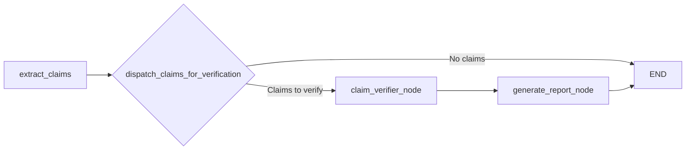
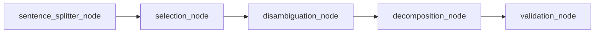
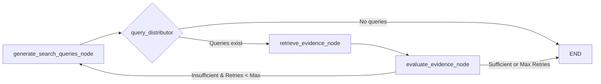

# Thesis Diagrams (Mermaid)

## Figure 4.1: High-Level Architecture (Fact Checker MAS)
*Source: apps/agent/README.md*

## Figure 4.2: Claim Extractor Workflow
*Source: apps/agent/claim_extractor/README.md*

## Figure 4.3: Claim Verifier Workflow
*Source: apps/agent/claim_verifier/README.md*

